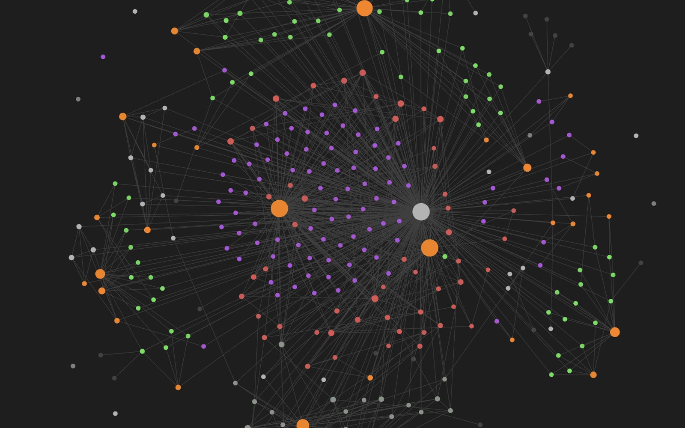

# local-brain

A local-first knowledge engine. An Obsidian Markdown vault is the canonical
store; a Knowledge API is the only writer, and it maintains the vault's
invariants so an agent can retrieve against it reliably.



Indexes, backlinks, graph exports and embeddings are derived and disposable.
Delete them and rebuild.

```bash
uv sync
export BRAIN_VAULT=~/notes

uv run brain init
uv run brain create "OSI Model" --type concept --domain networking --answer "Seven layers."
uv run brain link concept_osi-model mentions concept_tcp
uv run brain search fiber
uv run brain backlinks concept_osi-model
uv run brain export-graph > graph.json
uv run brain scan            # what the API did not write
uv run brain doctor --apply  # repair what needs no human judgement
```

Every command takes `--json`, before or after the subcommand.

## Design

Markdown is canonical. Everything else is a projection, and that is proven
rather than asserted: `rm 90-meta/indexes/brain.db && brain reindex` returns
identical results for `list`, `backlinks`, `export-graph` and `search`, and
`--no-index` runs the whole API with no database at all.

Three properties do most of the work.

**Frozen ids.** An `id` is minted once and never re-derived from the title.
Obsidian rewrites filenames and `[[wikilinks]]` on rename but never touches
`id:` or `relationships:`, so code that re-slugs a changed title forks the graph
silently.

**Opaque bodies.** Frontmatter is recognized only at byte 0 and closes at the
first later line that is exactly `---` or `...`. Nothing past that is parsed, so
a `---` inside a fenced code block cannot truncate a note. Updates splice the
frontmatter and re-emit body bytes verbatim.

**Honest concurrency.** Obsidian and the human co-author these files. Writes are
`temp, fsync, os.replace` with a `(mtime_ns, size, sha256)` compare-and-swap, and
`scan` and `doctor` converge whatever else touched the vault.

## Retrieval quality

Retrieval is scored rather than assumed. A golden set lives in the vault at
`90-meta/eval/golden.jsonl`, and `brain eval` reports precision@1, recall@k and
MRR so a change either moves the number or does not.

A second, neutral question set is worth keeping. A golden set written alongside
alias enrichment will share vocabulary with the notes it is meant to test, which
flatters lexical retrieval. Measuring both is the only way to see the gap.

## Project rules

The ETL derives a project name from each session's working directory. Those
rules are yours, not the package's, so they live in your vault at
`90-meta/brain.toml`:

```toml
[projects]
repos = ["my-app", "my-lib"]

[projects.aliases]
"acme" = "acme"
```

`aliases` maps a path fragment to a name and is checked first. `repos` is checked
in order, so list longer names before the shorter names they contain. With no
config the engine maps nothing and returns the final path segment.

## Layout

| Path | What lives there |
|---|---|
| `brain/domain/` | Pure logic: ids, slugs, edges, models. No I/O. |
| `brain/application/` | Knowledge API, validators, evaluation. |
| `brain/infrastructure/` | Vault, markdown, index, audit log. |
| `brain/etl/` | Session extraction, prefilter, reconcile, inbox. |
| `docs/architecture.md` | Invariant table. |

## Tests

```bash
uv run pytest
```
